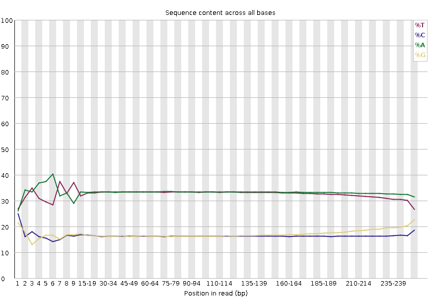

“Per Base Sequence Content” plots the percentage of each of the four nucleotides (T, C, A, G) at each position across all reads in the input sequence file.
As for the per base sequence quality, the x-axis is non-uniform.

> 
> 

In a random library we would expect that there would be little to no difference between the four bases.
The proportion of each of the four bases should remain relatively constant over the length of the read with `%A=%T` and `%G=%C`, and the lines in this plot should run parallel with each other.

## Biases

It’s worth noting that some library types will always produce biased sequence composition, normally at the start of the read.

=== "RNA-seq"

    Libraries produced by priming using random hexamers (including nearly all RNA-Seq libraries), and those which were fragmented using transposases, will contain an intrinsic bias in the positions at which reads start (the first 10-12 bases). This bias does not involve a specific sequence, but instead provides enrichment of a number of different K-mers at the 5’ end of the reads. Whilst this is a true technical bias, it isn’t something which can be corrected by trimming and in most cases doesn’t seem to adversely affect the downstream analysis. It will, however, produce a warning or error in this module.

    !!! quote "Figure"
        <figure markdown>
        
        </figure>

=== "ChIP-seq"
    ChIP-seq data can also encounter read start sequence biases in this plot if fragmenting with transposases. With bisulphite converted data, e.g. HiC data, a separation of G from C and A from T is expected:

    !!! quote "Figure"
        <figure markdown>
        
        </figure>
