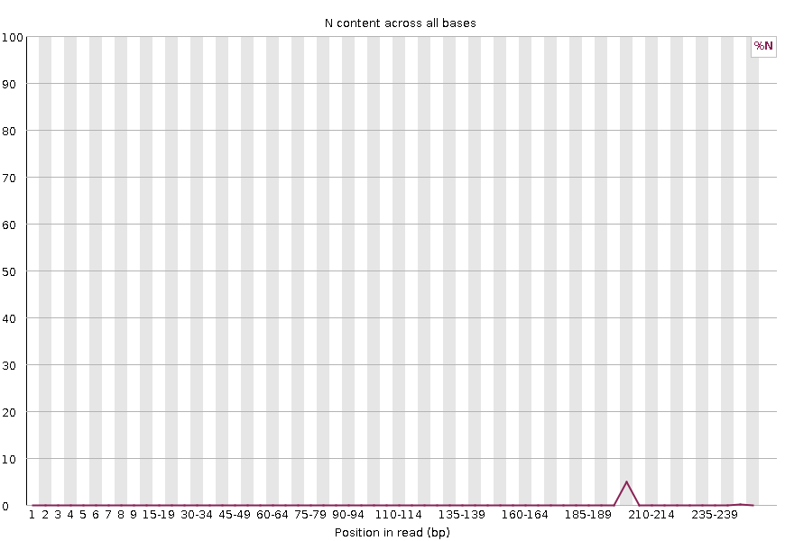

If a sequencer is unable to make a base call with sufficient confidence, it will write an `N` instead of a conventional base call.
This plot displays the percentage of base calls at each position or bin for which an `N` was called.

> 
> 

It’s not unusual to see a very high proportion of `N`s appearing in a sequence, especially near the end of a sequence
But this curve should never rises noticeably above zero.
If it does this indicates a problem occurred during the sequencing run.
