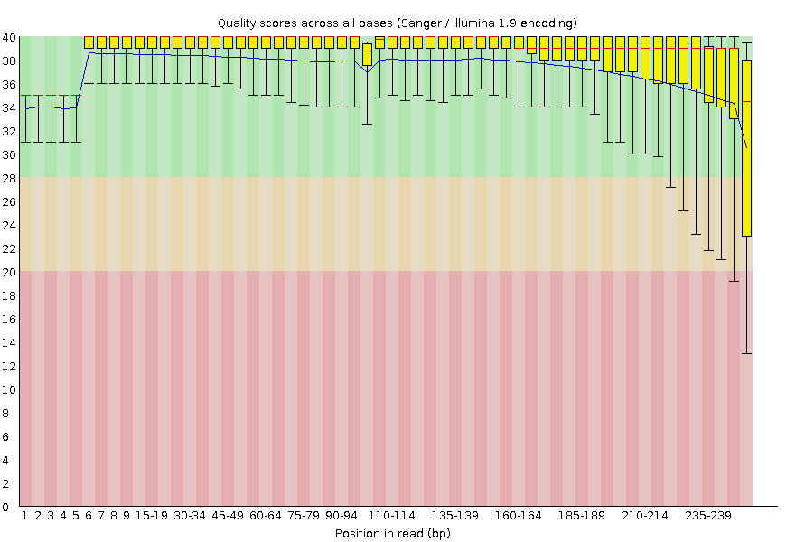
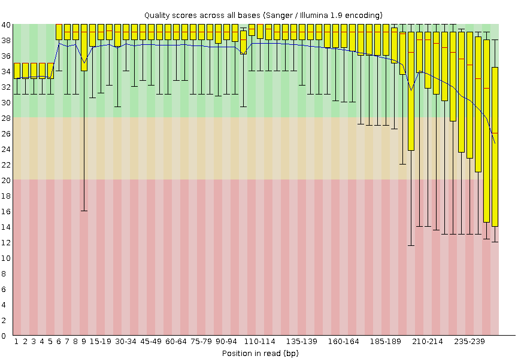

With FastQC we can use the per base sequence quality plot to check the base quality of the reads.
On the x-axis are the base position in the read. In this example, the sample contains reads that are up to 251 bp long.

=== "Forward"
    !!! quote "Figure"
        <figure markdown>
        
        </figure>
=== "Reverse"
    !!! quote "Figure"
        <figure markdown>
        
        </figure>

!!! important
    The x-axis is not always uniform.

    When you have long reads, some binning is applied to keep things compact.
    We can see that in our sample.
    It starts out with individual 1-10 bases.
    After that, bases are binned across a window a certain number of bases wide.
    Data binning means grouping and is a data pre-processing technique used to reduce the effects of minor observation errors.
    The number of base positions binned together depends on the length of the read.
    With reads >50bp, the latter part of the plot will report aggregate statistics for 5bp windows.
    Shorter reads will have smaller windows and longer reads larger windows.
    Binning can be removed when running FastQC by setting the parameter “Disable grouping of bases for reads >50bp” to Yes.

For each position, a boxplot is drawn with:

-   the median value, represented by the central red line
-   the inter-quartile range (25-75%), represented by the yellow box
-   the 10% and 90% values in the upper and lower whiskers
-   the mean quality, represented by the blue line

The y-axis shows the quality scores. The higher the score, the better the base call.
The background of the graph divides the y-axis into very good quality scores, scores of reasonable quality, and reads of poor quality.

It is normal with all Illumina sequencers for the median quality score to start out lower over the first 5-7 bases and to then rise.
The quality of reads on most platforms will drop at the end of the read.
This is often due to signal decay or phasing during the sequencing run.
The recent developments in chemistry applied to sequencing has improved this somewhat, but reads are now longer than ever.

## Signal decay

The fluorescent signal intensity decays with each cycle of the sequencing process.
Due to the degrading fluorophores, a proportion of the strands in the cluster are not being elongated.
The proportion of the signal being emitted continues to decrease with each cycle, yielding to a decrease of quality scores at the 3’ end of the read.

## Phasing

The signal starts to blur with the increase of number of cycles because the cluster looses synchronicity. As the cycles progress, some strands get random failures of nucleotides to incorporate due to:

-   Incomplete removal of the 3’ terminators and fluorophores
-   Incorporation of nucleotides without effective 3’ terminators
-   This leads to a decrease in quality scores at the 3’ end of the read.

## Overclustering

Sequencing facilities can overcluster the flow cells.
It results in small distances between clusters and an overlap in the signals.
Two clusters can be interpreted as a single cluster with mixed fluorescent signals being detected, decreasing signal purity.
It generates lower quality scores across the entire read.

## Instrumentation breakdown

Some issues can occasionally happen with the sequencing instruments during a run. Any sudden drop in quality or a large percentage of low quality reads across the read could indicate a problem at the facility.
Some examples of such issues.

> 
> 

> 
> 

> 
> 
