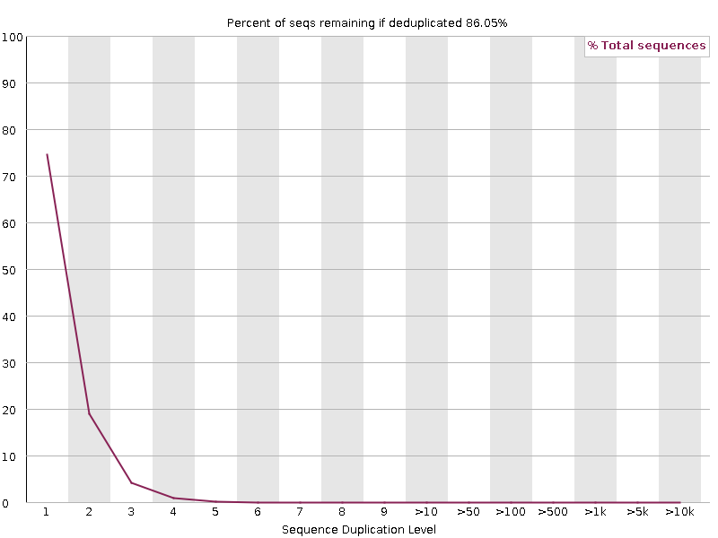

The graph shows the percentage of reads of a given sequence in the file which are present a given number of times in the file:

> 
> 

In a diverse library most sequences will occur only once in the final set. A low level of duplication may indicate a very high level of coverage of the target sequence, but a high level of duplication is more likely to indicate some kind of enrichment bias.
Two sources of duplicate reads can be found:

-   PCR duplication in which library fragments have been over-represented due to biased PCR enrichment
    It is a concern because PCR duplicates misrepresent the true proportion of sequences in the input.
-   Truly over-represented sequences such as very abundant transcripts in an RNA-Seq library or in amplicon data (like this sample)
    It is an expected case and not of concern because it does faithfully represent the input.

FastQC counts the degree of duplication for every sequence in a library and creates a plot showing the relative number of sequences with different degrees of duplication.

For whole genome shotgun data it is expected that nearly 100% of your reads will be unique (appearing only 1 time in the sequence data). Most sequences should fall into the far left of the plot. This indicates a highly diverse library that was not over sequenced. If the sequencing depth is extremely high (e.g. > 100x the size of the genome) some inevitable sequence duplication can appear: there are in theory only a finite number of completely unique sequence reads which can be obtained from any given input DNA sample.

More specific enrichments of subsets, or the presence of low complexity contaminants will tend to produce spikes towards the right of the plot.
These high duplication peaks will most often appear in the blue trace as they make up a high proportion of the original library, but usually disappear in the red trace as they make up an insignificant proportion of the deduplicated set.
If peaks persist in the red trace then this suggests that there are a large number of different highly duplicated sequences which might indicate either a contaminant set or a very severe technical duplication.

It is usually the case for RNA sequencing where there is some very highly abundant transcripts and some lowly abundant.
It is expected that duplicate reads will be observed for high abundance transcripts.
