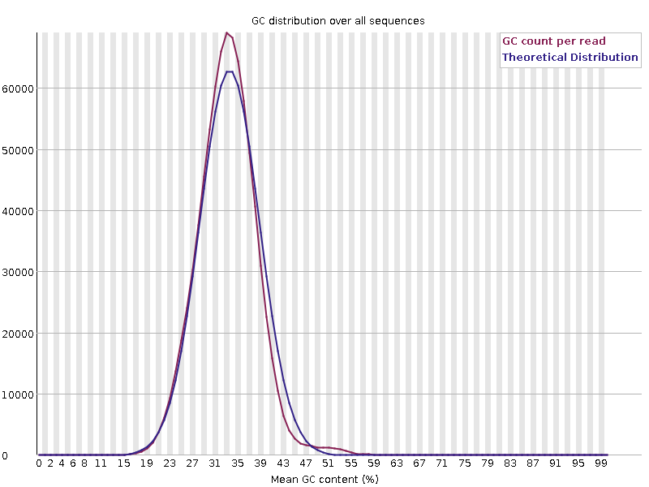

This plot displays the number of reads vs. percentage of bases G and C per read.
It is compared to a theoretical distribution assuming an uniform GC content for all reads, expected for whole genome shotgun sequencing, where the central peak corresponds to the overall GC content of the underlying genome.
Since the GC content of the genome is not known, the modal GC content is calculated from the observed data and used to build a reference distribution.

> 
> 

An unusually-shaped distribution could indicate a contaminated library or some other kind of biased subset.
A shifted normal distribution indicates some systematic bias, which is independent of base position.
If there is a systematic bias which creates a shifted normal distribution then this won’t be flagged as an error by the module since it doesn’t know what your genome’s GC content should be.

But there are also other situations in which an unusually-shaped distribution may occur.
For example, with RNA sequencing there may be a greater or lesser distribution of mean GC content among transcripts causing the observed plot to be wider or narrower than an ideal normal distribution.
